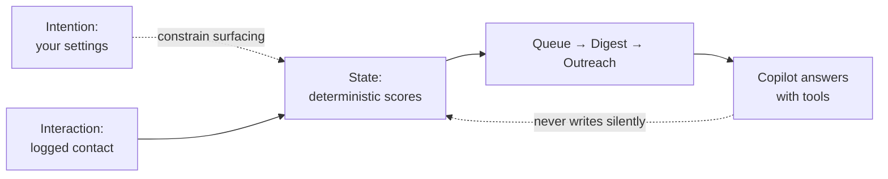

# Relationship Intelligence — who needs you this week, and why

> Every contact list stores people. None of them watch how relationships
> move over time and tap you on the shoulder before drift becomes loss.


Relationship Intelligence scores every relationship deterministically
from logged contact history, surfaces who needs attention with the
reason attached, and lets an agentic Copilot answer questions over your
data with citations. It proposes; you decide. Approval is the only path
from AI suggestion to trusted state — nothing sends, nothing records
contact, nothing becomes truth without you.

## The problem: relationships decay silently

Nobody notices a contact going cold until the moment they need them —
the introduction, the referral, the hire — and by then the cost is
already paid. People run networks on guilt and memory ("I should
probably reach out…") with no evidence behind it. The methodological
problem is prior to any feature: **before asking what to do about a
relationship, establish what the record actually shows — what was
logged, what the model derived, and what you yourself asked for — and
keep those three strictly separated.**

## What the system does

Given your logged contact history, it scores every relationship with an
exponential tie-decay model, measures each contact's own rhythm, ranks
an attention queue with per-row reasons ("quiet 120d vs ~30d rhythm"),
enriches it with upcoming events and open commitments, and lets you
express intent in human terms ("stay in touch every 10 days") that
constrains surfacing without touching scores. Paste any text and the AI
turns it into reviewable proposals. Ask the Copilot anything — it calls
read-only tools over your data and cites what it used. Approve drafts,
batches, and findings one by one; nothing acts externally, ever.

## Core framework: three layers that never mix

- **User intention** — cadence, reminders, importance, suggestion
  opt-outs. What you *want*. Never fabricates contact.
- **System-derived state** — urgency, silence, bands, rhythm, network
  flags. What the *data says*. Computed deterministically, explained
  always.
- **Actual interaction** — logged calls, emails, meetings, messages.
  What *happened*. The only thing that moves relationship state.



Details: [methodology](docs/methodology.md).

## What you get

Not features — the outputs the system produces, each with provenance:

- A ranked attention queue where every row carries its reason, evidence
  grade, and rhythm source ("You asked for…" vs "Usual rhythm")
- A weekly digest with signed one-click action links and delivery dedup
- Outreach batches: signal-built member lists with reasons, per-person
  grounded drafts, approval that contacts nobody
- Meetings where planned context never becomes evidence; confirmation
  writes real interactions plus derived memory
- A Things-I-Found review queue: pasted text → findings → conflicts →
  your approval → trusted state with source excerpts
- Per-person preferences and reminders with audit history, global
  defaults with precedence, and a state machine that never fakes contact
- A Copilot that lists all 15 members of an org with citations, filters
  contacts by any combination, tolerates typos via suggestions, and
  proposes before mutating — confirmation-gated, always

## Methodology at a glance

**Tie strength as decayed history.** Each event boosts 1.0, decaying
with a 60-day half-life; equal weights, no hidden tuning.

**Rhythm as measured median.** ≥3 gaps blend median with persona prior
(3 pseudo-observations, clamped 3–180d); fewer gaps show the prior
labeled estimated, bands capped at Drifting.

**Urgency as deficit.** `100·(1 − strength/your-max)` — a ranking aid
over your own history, never a probability or verdict.

**Reminders as intent.** A derived state machine (Disabled/Idle/Due/
Snoozed/Skipped/Completed) where completion happens only through a
real logged interaction.

Details: [methodology](docs/methodology.md) · [pipelines](docs/pipelines.md).

## User experience

Today → Attention → Things I Found → People → Organizations →
Meetings → Outreach → Network → Digest, with the Copilot drawer
everywhere. Full screen-by-screen tour with the AI's role on each:
[user-experience](docs/user-experience.md).

## Technical architecture

Core (domain + scoring + services) → AI (Semantic Kernel agent,
~40 tools) → Infrastructure (EF Core, SQL Server) → Api (10
controllers, JWT, composition root) → React client. Boundaries enforced
by project references and architecture tests. Details:
[architecture](docs/architecture.md) · [data](docs/data.md) ·
[api](docs/api.md).

## Copilot

Classify → route → tool-call loop over owner-scoped services; read
tools answer, confirmation-gated writes propose first; per-user
Gemini/OpenAI-compatible provider, secrets server-side. Technical and
business account: [copilot](docs/copilot.md).

## Run (local dev, no Docker)

```powershell
$env:ASPNETCORE_ENVIRONMENT = "Development"
dotnet run --project RelationshipIntelligence.Api/RelationshipIntelligence.Api.csproj --urls http://localhost:5156 --launch-profile http
npm --prefix relationship-intelligence-client run dev -- --port 5173 --strictPort
dotnet test RelationshipIntelligence.sln
```

Sign in with `testuser@contactsmanager.dev` / `Test123!`. Details:
[development](docs/development.md) · [reproducibility](docs/reproducibility.md).

## Documentation index

| Document | What it covers | For whom |
|---|---|---|
| [Overview](docs/overview.md) | What it is, what it isn't, status | Everyone |
| [Product vision](docs/product-vision.md) | Why it matters, horizons | Owners |
| [User experience](docs/user-experience.md) | Every screen + AI on each | Owners |
| [Methodology](docs/methodology.md) | Equations, parameters, grades | Researchers, devs |
| [Pipelines](docs/pipelines.md) | Stage rules + failure behavior | Devs |
| [Architecture](docs/architecture.md) | Layers, flows, limits | Devs |
| [Copilot](docs/copilot.md) | Agent tech + business value | Owners, devs |
| [Data](docs/data.md) | Tables, isolation, seeds | Devs |
| [API](docs/api.md) | Endpoint reference | Devs |
| [Testing](docs/testing.md) | 296 tests: invariants per area | Devs |
| [Reproducibility](docs/reproducibility.md) | Rebuild the system state | Researchers, devs |
| [HR guide](docs/for-hr-recruiters.md) | Pipelines, outreach at scale | HR/recruiters |
| [Research guide](docs/for-researchers.md) | Citable constructs, limits | Researchers |
| [Development](docs/development.md) | Setup, scripts, conventions | Devs |
| [CI/CD](docs/ci-cd.md) | Pipeline, gates, delivery | Devs, owners |
| [Evidence ledger](docs/documentation-evidence-ledger.md) | Claim → source → status | Researchers |
| [Existing methodology](docs/METHODOLOGY.md) | Original method record | Researchers |
| [Architecture decisions](docs/architecture-decisions/) | ADRs 01–07 | Devs |

**Status: working system.**
