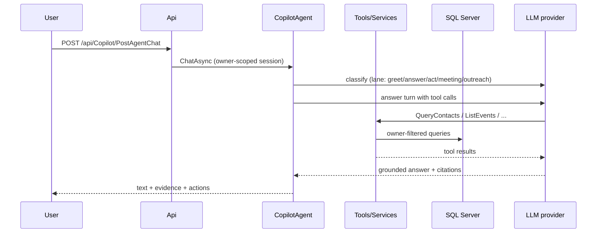

# Architecture

Clean Architecture with real project boundaries (unlike the reference
style of folder-level separation, these are separate assemblies with
the dependency rule enforced by project references and
`ArchitectureTests`).

## Layers and responsibilities

- **Core** (`RelationshipIntelligence.Core`) — domain entities, services
  (scoring, interactions, memory, events, meetings, outreach, digest,
  ingestion, preferences), DTOs, repository contracts, service
  contracts. No reference to AI, Infrastructure, or web. Pure rules
  (`TieDecayModel`, `PersonaPriors`, `NetworkAnalyzer`) are statics
  here, unit-tested without keys or network.
- **AI** (`RelationshipIntelligence.AI`) — Semantic Kernel Copilot:
  `CopilotAgent` (classify → route → tool-call loop), `CopilotService`
  (legacy single-shot Q&A retained for briefing/plan/draft helpers),
  `RelationshipQueryPlugin` (~40 read tools), `PlanningPlugin`,
  `ActionPlugin` (confirmation-gated writes), extractors, kernel
  factory, session store. References Core only.
- **Infrastructure** (`RelationshipIntelligence.Infrastructure`) — EF
  Core `AppDBContext` (31 `DbSet`s, per-user global query filters),
  repositories, 30 migrations. SQL Server (`Contect_Manager`).
- **Api** (`RelationshipIntelligence.Api`) — 10 controllers (Account,
  Contacts, Copilot, Digest, Ingestion, Meeting, Network, Outreach,
  Preference, + `CustomWebController` base with global auth filter),
  JWT Bearer (lowercase `jwt:` keys), ownership filters, CORS,
  `RelationshipMaintenanceJob` (nightly recompute). The composition
  root: all DI wiring lives in `Program.cs`.
- **Client** (`relationship-intelligence-client`) — React 19 +
  TypeScript + Vite + Tailwind, React Router (16 pages), token in
  `localStorage` (`ri.token`), `VITE_API_URL` defaulting to
  `http://localhost:5156`.

## Honest limitations

- JWT key lookup is case-sensitive-lowercase; a PascalCase lookup 500s
  every request (fixed once, documented so it is not reintroduced —
  see code comment in `Program.cs`).
- Global `Consumes("application/json")` means bodiless POSTs 415 — web
  clients must send `{}` (pinned by comment + client helper).
- No migrations framework beyond EF `database update`; schema changes
  are migration files, applied manually.
- LLM provider (Gemini/OpenAI-compatible, per-user key, DataProtected)
  is a runtime external: identical code with different provider state
  produces different Copilot runs. Deterministic core stays testable
  offline via interface seams.

## Request flow (single chat turn)

Writes flow the same way but stop at a proposal; only an explicit
confirmation (or a message that itself orders one mutation) sets
`confirmed=true` on the action tool.
