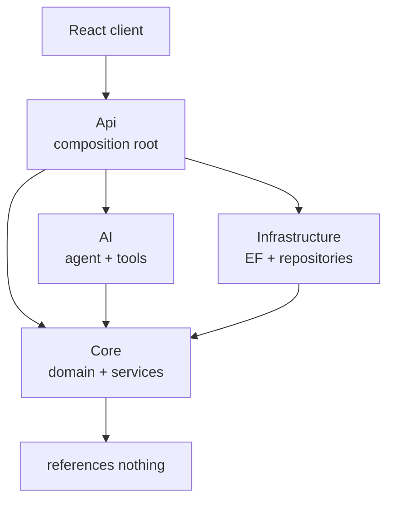
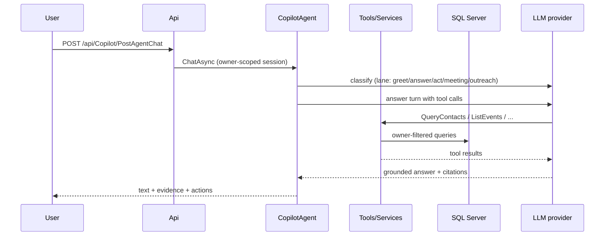

# Architecture: Clean Architecture, SOLID, and the patterns that hold it together

Dependency rule, enforced — not aspirational:

`Core` references nothing. `AI` references Core only. `Infrastructure`
references Core only. `Api` references all three and wires them in
`Program.cs` — it is the sole composition root. The client talks to the
system only through the API. `ArchitectureTests` pins these boundaries
(Core never references AI; scoring types stay isolated); a violation
fails the build.

## SOLID, concretely

- **Single responsibility**: one class per file, one job per class —
  `RelationshipScoringService` scores, `DigestService` selects,
  `OutreachService` builds batches, `IngestionService` runs the
  review pipeline, `RelationshipPreferenceService` owns intent. No
  god services; no utils dumping grounds.
- **Open/closed**: new Copilot capabilities arrive as new
  `[KernelFunction]` tools on existing plugins — the agent loop,
  routing, and session code never change. New outreach signals add a
  branch in `ResolveMembersAsync`, not a new service.
- **Liskov**: services are consumed through `ServiceContracts` /
  `RepositryContracts` interfaces; tests substitute mocks for every
  boundary (`Mock<IPersonSearcherService>`, …) without behavior change.
- **Interface segregation**: narrow contracts per capability
  (`IEventService`, `IMeetingService`, `IOutreachService`,
  `IngestionRepositoryContract`, `PreferenceAuditRepositoryContract`,
  …) instead of one repository god-interface. Consumers depend only on
  what they call.
- **Dependency inversion**: high-level services take interfaces in
  constructors (`InteractionService` takes `IUnitOfWork`, not
  `SqlContext`); `Program.cs` resolves concretes. Optional
  cross-cutting inputs (`IEventService?`, preference repos) are
  nullable constructor parameters with graceful degradation, never
  hidden statics.

## Design patterns in use (named, with locations)

- **Repository** — one repository class per contract in
  `Infrastructure/Repositries/` (person, memory, event, meeting,
  outreach, ingestion, preference, audit, defaults…); services never
  touch `DbContext` directly.
- **Unit of Work** — `IUnitOfWork.SaveChangesAsync` is the single commit
  point per use case; services add rows then commit once.
- **DTO / Data Mapper** — `Core/DTOs` wire shapes per area
  (`MeetingResponse.FromMeeting`, `EventResponse.FromEvent`,
  `PersonViewDTO` converters); entities never cross the API boundary.
- **Plugin / Tool** (Semantic Kernel) — `RelationshipQueryPlugin`
  (~40 read tools), `PlanningPlugin`, `ActionPlugin`; the agent
  discovers capabilities via `[KernelFunction]` + `Description`, so new
  tools need no routing changes.
- **Agent loop** — `CopilotAgent.ChatAsync`: classify lane → route to
  handler → tool-call answer turn → enrich evidence/citations/actions.
  Session state (`AgentSessionStore`, 30-min expiring) carries focus,
  disambiguation picks, and batch context across turns.
- **State machine (derived, not stored)** — reminder state
  (Disabled/Idle/Due/Snoozed/Skipped/Completed) computed in
  `GetReminderStateAsync` from stored fields, so state can never drift
  from data. Same idea in meeting (`Preparation→…→Confirmed`) and
  batch/draft lifecycles.
- **Strategy (implicit)** — outreach signals (`attentionQueue`,
  `outsideCadence`, `neglected`, …) are interchangeable member-source
  strategies behind one resolver; scoring precedence (explicit >
  global > inference) is a strategy chain over cadence sources.
- **Decorator-like enrichment** — queue rows are computed once, then
  event occurrences attached without touching scores, bands, or order
  (`EnrichWithUpcomingEventsAsync`).
- **Observer (lightweight)** — `InteractionService.LogAsync` notifies
  dependents: scoring recompute + reminder-cycle completion, both
  best-effort and failure-isolated so logging never fails.
- **Builder (fluent)** — outreach batch assembly (signals → members →
  settings → drafts → review → approve) and draft context assembly
  (`BuildDraftContextAsync`) compose the final artifact step by step.
- **Façade** — controllers are thin façades: validate, delegate to one
  service call, map errors to HTTP codes. No business logic in
  controllers.
- **Ownership filter (interceptor)** — `PersonOwnershipFilter` /
  `MeetingOwnershipFilter` plus global EF query filters
  (`ApplicationUserId == _currentUserId` on every user table) enforce
  isolation at two independent layers.

## Layers and responsibilities

- **Core** (`RelationshipIntelligence.Core`, references nothing) —
  `Domain/Entities` (Person, Interaction, RelationshipState, memory,
  event, meeting, outreach, ingestion, preference entities — 31
  tables), `Services` (scoring, interactions, memory, events,
  meetings, outreach, digest, ingestion, preferences, search, orgs —
  one class per file, behind contracts), `DTOs` (wire shapes per
  area). Pure rules (`TieDecayModel`, `PersonaPriors`,
  `NetworkAnalyzer`) are statics, unit-tested without keys or network.
- **AI** (`RelationshipIntelligence.AI`, references Core only) —
  `CopilotAgent`, `RelationshipQueryPlugin`, `PlanningPlugin`,
  `ActionPlugin`, `CopilotService` (legacy single-shot Q&A kept for
  briefing/plan/draft helpers), `IngestionExtractor` +
  `MeetingExtractor` (LLM → strict contract), `KernelFactory`,
  `AgentSessionStore`, `PersonNameExtractor` (typo-tolerant
  similarity), `PreferenceScheduleParser` (natural language →
  supported days).
- **Infrastructure** (`RelationshipIntelligence.Infrastructure`) — EF
  Core `AppDBContext` (31 `DbSet`s, per-user global query filters),
  one repository class per contract, 30 migrations. SQL Server
  (`Contect_Manager`); seeds (1 user, 10 persons + lookups,
  11-contact demo workspace).
- **Api** (`RelationshipIntelligence.Api`, composition root) — 10
  controllers + `CustomWebController` base with global auth filter,
  JWT Bearer (lowercase `jwt:` keys), ownership filters, CORS,
  `RelationshipMaintenanceJob` (nightly recompute).
- **Client** (`relationship-intelligence-client/src`) — `pages/` (16),
  `components/` (attention-row, explain-drawer, briefing-block,
  preference-card, ingest-dialog, copilot-drawer, …), `lib/` (`api.ts`
  token + 401 handling, `auth.tsx`, `copilot.tsx`, `ingestion.ts`,
  `format.ts` canonical silence mirror, `types.ts` camelCase wire
  shapes). React 19 + TypeScript + Vite + Tailwind.
- **Tests** (296: 272 + 24) — one class per area, mocks at every
  contract boundary.

## Honest limitations

- JWT key lookup is case-sensitive-lowercase; a PascalCase lookup 500s
  every request (fixed once, documented so it is not reintroduced —
  see code comment in `Program.cs`).
- Global `Consumes("application/json")` means bodiless POSTs 415 — web
  clients must send `{}` (pinned by comment + client helper).
- No migrations automation beyond EF `database update`; schema changes
  are migration files, applied manually.
- LLM provider (Gemini/OpenAI-compatible, per-user key, DataProtected)
  is a runtime external: identical code with different provider state
  produces different Copilot runs. Deterministic core stays testable
  offline via interface seams.

## Request flow (single chat turn)

Writes flow the same way but stop at a proposal; only an explicit
confirmation (or a message that itself orders one mutation) sets
`confirmed=true` on the action tool.
