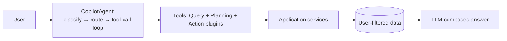

# Copilot: technical account and business value

## Technical: how it works

The Copilot is a **Semantic Kernel agent over owner-scoped application
services** — not a chatbot with database access. One production path:

- **Routing** (`CopilotAgent.ChatAsync`): one LLM call classifies the
  request into a lane (`greet` / `answer` / `act` / `meeting` /
  `outreach`); a second LLM call with function-calling answers. No
  keyword or regex routing exists anywhere in the chat path.
- **Read tools** (`RelationshipQueryPlugin`, ~40 `KernelFunction`s):
  `QueryContacts` (the general contact finder — every filter the user
  names maps to a parameter), `ListInteractions` (per-person, type +
  since), `ListOrganizations` / `ListOrganizationMembers`,
  `ListEvents`, `ListMeetings`, `ListOutreachBatches`, `ListMemories`,
  queue/digest/reminder/preference/history readers, plus analytic
  finders (outside-cadence, trajectory changes, upcoming important
  events, pending follow-ups, explainers). Every tool inherits user
  isolation from the service it calls.
- **Write tools** (`ActionPlugin`): log interaction, record event, edit
  memory, create goal, create meeting draft, confirm findings, accept
  suggestions, save preferences, set/snooze/disable reminders. Every
  one takes an explicit `confirmed` flag: the model may set it only
  after the user confirmed in conversation, or when the message itself
  orders one concrete mutation. Two-step proposal tools
  (`ProposeReminder/ProposeCadence`) return a proposal first and write
  only on confirmation; unsupported schedules are rejected honestly via
  the deterministic `PreferenceScheduleParser`.
- **Planning tools** (`PlanningPlugin`): meeting briefs, call briefs,
  outreach batch previews, draft previews, plan suggestions, memory-gap
  proposals — all reviewable previews, none contacting anyone.
- **Provider setup**: per-user Gemini/OpenAI-compatible key, model, and
  base URL (`AiProviderSettings`, DataProtected at rest, never returned
  by the API). Unconfigured → 409 with setup guidance; provider outage
  → 503 with retry guidance; batches persist so review always survives
  an outage.
- **Prompt contract** (`CopilotPrompts.System`): four layers in every
  substantive answer (Observed / Derived / Interpretation /
  Recommendation), never an inference as fact, deterministic outputs
  explained never recomputed, user memory canonical, concise human
  voice, tools never named.

## Business: why it matters

- **Leverage, not automation.** The Copilot turns "I have 200 contacts"
  into "here are 5 people, exactly why each needs you, and a drafted
  message per person" — then stops. The user reviews, edits, approves,
  and logs the real conversation. Every minute of AI work removes busy
  work; no minute removes judgment.
- **Trust as a feature.** Citations on every claim, evidence drawers,
  source excerpts, confirmation gates, audit trails, and honest "nobody
  matches" / "I don't support that schedule" answers. Trust compounds:
  each verified answer makes the next proposal easier to accept.
- **Answers the questions people actually ask.** "Who works at
  Proceedit?" → 15 cited names. "Which contacts there did I call since
  last week?" → filtered from the real log. "What is going on with
  [typo'd name]?" → spelling-variant resolution before any absence
  claim. "Remind me about Mohamed every 10 days" → proposal, confirm,
  persisted with audit.
- **Segments served**: owners protect key relationships before they
  cool; recruiters run talent pipelines with evidence-backed outreach;
  researchers get a citable, deterministic substrate under the
  assistant's prose (see [for-researchers](for-researchers.md)).
