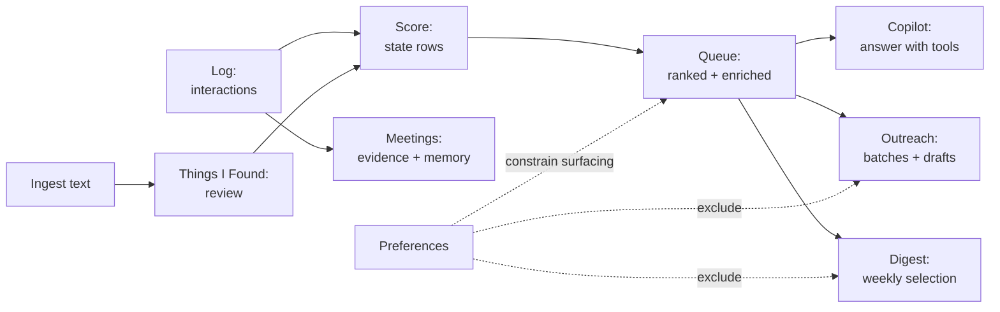

# Pipelines

Stage-by-stage data flow. Each stage reads the previous stage's stored
rows — never re-fetching, never re-deciding. Rules, formulas, and
failure behavior included.

## 1. Log → Score

`InteractionService.LogAsync` (`Core/Services/InteractionService.cs:43-88`):
validate (non-null, DataAnnotations, authenticated, date ≤ tomorrow,
known person) → insert `Interaction` → if the person has an enabled
reminder, stamp `LastCompletedAtUtc` and clear snooze (sole completion
path; failures swallowed so logging never fails) → `SaveChanges` →
`RecomputeForPairAsync`. CSV import (`ImportCsvAsync`) follows the same
pattern in bulk.

`RelationshipScoringService` recomputes per owner, per pair, or per id
set: strengths via `TieDecayModel.StrengthAt`, max-normalized urgency,
`BuildState` writes all state fields, one snapshot per person per day
(skipped for `NoHistory`). Full field list and ordering in
[methodology](methodology.md) §§2–6.

Failure behavior: unknown person → `ArgumentException`; future date →
`ValidationException`; unauthenticated → `UnauthorizedAccessException`.
Scoring failures are retried nightly by `RelationshipMaintenanceJob`.

## 2. Score → Queue

`GetQueueAsync(top)`: owner affinities minus `NoScore`-tagged, joined to
states, minus `NoHistory`, ordered by urgency → preference priority →
system importance → oldest contact. Intent inputs applied as documented
in [methodology](methodology.md) §7, then event enrichment (21-day
window, 7-day signal rule). `top ≤ 0` defaults to 7; overview uses 200
so band counts are totals.

## 3. Queue → Digest

`DigestService.BuildAsync`: skip when prefs disabled or anonymous;
recompute stale states; drop suggestion-excluded people; keep urgency ≥
threshold (default 50, clamp 0–100) AND silence > 7 days; take `Count`
(default 5, clamp 1–7). Delivery deduplicated per Monday-midnight week
(same `DeliveryId` returned, selection snapshot persisted as JSON).
Network health = mean(100 − urgency). Entries carry HMAC-signed
(`DigestActionSigner`, 7-day expiry) action URLs: "reached out" logs a
real Email interaction; every click writes a `DigestMetric`.

## 4. Queue → Outreach

`OutreachService`: signals (`attentionQueue`, `outsideCadence`,
`neglected` ≥2× rhythm, `recentMeetings`, `upcomingEvents`,
`pendingCommitments`, `companyMembers` exact-match) resolve members with
reasons, minus batch-skipped and preference-excluded people, capped at
12 (batch) / 50 (persons). Batch lifecycle Draft → Ready → Approved
(Discarded anytime); drafts Draft → Edited/Approved/Rejected, stale
drafts discarded on regenerate. Drafts grounded per person (queue state,
last-5 interactions, memory split into highlights vs style, 21-day
events, open commitments) with a `CONTEXT-USED` trailer; thin context
flagged `LimitedContext`. **Approval sends nothing** (explicit log
line); the user logs the real interaction afterward.

## 5. Meetings: planned ≠ evidence

`MeetingService`: Preparation → Draft → Processing → Processed →
Confirmed (Discarded anytime). `BeginLogging` requires Preparation;
transcript requires Preparation/Draft; `Process` requires Draft plus
transcript-or-notes and reverts to Draft on failure; `Confirm` requires
Processed, a real date, and every selected participant mapped +
confirmed. Confirm writes one `Meeting`-type interaction per selected
person (title ≤100, description = accepted finding titles + `Source:
Meeting — …`) plus derived memory (`MeetingDerived`, duplicate-checked).
Agenda/preparation never enter extraction; only transcript + notes do
(`SubmitForMeetingAsync`).

## 6. Text → Things I Found → trusted state

`IngestionService`: Submit (validate ≤50k chars, owned meeting if set,
SHA-256 idempotency → return existing) → Process (known people ≤200 to
the extractor; empty → explicit no-op; else map ≤50 findings:
subject resolution → slot mapping → conflict analysis) → Review
(Approved/Rejected/Pending + Edited; reviewer email/date captured;
**no durable write**) → Approve finding/person/batch (only
Approved|Edited, never Unresolved/Contradictory). Application routes:
memory (duplicate-checked, supersede-old→Done, `IngestionDerived`),
person field (role/org appended, others overwritten via updater),
event (requires reviewer-confirmed date), relation (memory entry),
new person (requires reviewer email, per-batch name dedupe).
Batch status: Applied / PartiallyApplied / Pending / Discarded
(discard refused once Applied).

Finding model: subject (+object for relations), one slot only
(field | memory | event | relation — supported vocabularies enforced,
everything else → Unresolved with reason), confidence
(High/Medium/Low/Unresolved/Contradictory), conflict
(None/Update/Contradiction/Duplicate) with existing value, proposal
action, approval state, full audit trail.

## 7. Preferences → surfacing (constraint, not bypass)

`RelationshipPreferenceService`: per-person cadence/importance/
priority/intent/exclusion + reminder schedule; global fallback
defaults; append-only audit (field, previous/new in human terms,
source User/Copilot/Import/Default, who, when). Removal deletes the row
(relationship reverts to defaults → inference) with revert-audit rows.
Snooze/skip only move timestamps. See [methodology](methodology.md) §10
for the state machine and completion rule.
